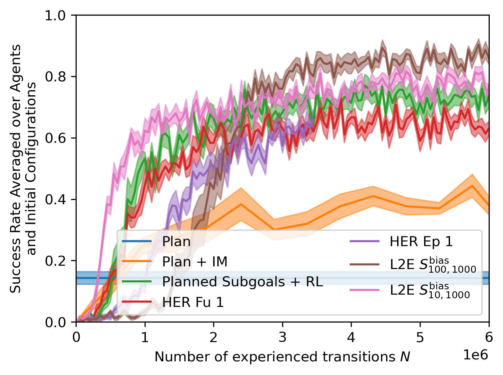

:warning: *Figure captions are hard to read if you use github in dark mode*
# Experiment 1: Obstacle Environment
We added this environment to expand the experimental evaluation of L2E.

## Description
The spherical end effector is rewarded for pushing the box to the green goal,
but is hindered by an obstacle in the middle of the table (see below).
Another difference to the original task is that the level of noise is increased.
At each step, the actual change in position of the end effector can be off up to 50% from the input velocity.

The planner outputs manhattan-like plans that avoid the obstacle. A single start-goal configuration can be solved using multiple plans, as shown below::

 | |
:-------------------------:|:-------------------------:|:-------------------------:
Obstacle Setup             |  Plan Execution Example 1           |  Plan Execution Example 2

We analytically encode these plans into a 6D latent space, corresponding to the initial, the final, and an intermediate planned position of the box. Please also see experiment 2 for a discussion of different types of encoding.

We compare against the baselines introduced in section 5.3 of the original version of the original version of the paper, as well as against the additional baseline on combining planning and learning that we introduce in Experiment 2.

## Motivation
Obstacle avoidance is a notoriously hard problem in robotics.
The obstacle "segments" the state space, posing a significant challenge to exploration (as illustrated by the performance of the HER baseline).

Since obstacle avoidance requires more complicated plans, the L2E agent faces a larger plan space (6D plan manifold instead of 4D).
Thus, this example allows us to compare data requirements of L2E dependent on the size of the plan space.

On the other hand, due to the high level of noise, purely planning-based approaches often fail as well (as illustrated by the performance of the "Plan" baseline)
A combination of planning and learning (such as the "Plan + IM" baseline and L2E) can possibly overcome these difficulties.

## Experiment Status
The following figure shows a comparison of L2E to the baselines used in figure 1b of the original version.
The runs are not fully finished yet; results are updated regularly.

## Preliminary Results
L2E performs significantly better than the pure learning HER baselines, the pure planning baseline ("Plan"), and the “Planned Subgoals + RL” baseline.
Currently, the runs are not fully finished, but initial results indicate that the performance of L2E exceeds the performance of the "Plan + IM" baseline as well.
The "Plan + IM" baseline executes the plan using an inverse model learned from data.

In comparison with the pushing experiment in the original version of the paper, L2E learns slower.
This is in part due to the higher dimensionality of the latent space of plan encodings (see also discussion of plan encodings below).
This poses a more challenging learning problem to the L2E agent.
In contrast, the "Plan + IM" baseline is independent of the size of the plan space, and performs comparably to the experimental setting in the original version. 

## Preliminary Discussion
This experiment reveals the following two aspects:
First, it reveals the importance of approximate plans in more complicated scenes, as illustrated by the difference between HER and L2E.
Even using HER, standard RL is not able to solve the task.
This even holds true if the RL agent is supported by a long-horizon planner that provides short-horizon subgoals, as illustrated by the difference between the “Planned Subgoals + RL” baseline and L2E.

Second, comparing L2E to the pushing example in the original version of the paper, it highlights that for larger plan spaces, more data is needed to train the L2E agent.

# Experiment 2: Additional Baseline on Combining Planning and Learning
We added this baseline to compare against more methods that, like L2E, also combine learning and planning.

Here we use the planner to create a sequence of subgoals that can be navigated by a RL agent. This approach is inspired by PRM-RL [Faust et al. 2017]; we will refer to it as “Planned Subgoals + RL”.

## Description
We use the planner to provide subgoals to the RL agent. The subgoal is selected as a box position on the plan that is 0.3 (1/10 of the table length) away from the current box position.
Once the subgoal is reached (tolerance 0.1), the next subgoal is selected.

Thus, long-term planning is provided by the planning module.
The RL agent on the other hand is tasked with learning the dynamics of the system to reach relatively short-term goals.
This RL agent is conditioned on subgoals, and trained using HER.
We use the sampling strategies "Episode 5" in case of the pushing environment included in original version, and "Future 5" in case of the obstacle environment. These performed best on the respective environment when used without any planning.

## Motivation
We added this baseline as an additional method (apart from the "Plan+IM" baseline) that also combines learning and planning.
While the "Plan+IM" baseline uses an inverse dynamics model to learn immediate actions that reach the next planned state, the “Planned Subgoals + RL” baseline allows the RL agent to learn behavior that lasts for longer than one time step.
Still, the RL agent does not need to reason about long-term behavior like the pure HER agents have to, since this is covered by the high-level planner.

## Experiment Status
The following figures show the performance of “Planned Subgoals + RL” compared to L2E as well as to the other baselines. Results are shown in both the pushing environment included in the original version of the paper, as well as the obstacle environment that was added during the review.
Some of the runs are not fully finished yet; results are updated regularly.

 | 
:-------------------------:|:-------------------------:
Pushing environment included in original version             |  Obstacle environment added during the review

## Preliminary Results
In the pushing environment included in original version, we find that the “Planned Subgoals + RL” baseline outperforms all other baselines that we initially included, but still shows lower performance than both versions of L2E.

In the obstacle environment added during the review, we find that “Planned Subgoals + RL” performs significantly worse than the L2E agents, as well as significantly worse than the “Plan + IM” baseline.

## Preliminary Discussion
In the pushing environment included in original version, using a learned policy that acts for multiple time steps in order to reach a subgoal (“Planned Subgoals + RL”) seems advantageous over using an inverse model that can only perform a single action (“Plan + IM”) to follow the plan.
However, L2E, which directly learns to execute entire plans using reward shaping, shows better performance compared to both baselines.

The results in the obstacle environment indicate that this relative advantage of “Planned Subgoals + RL” over “Plan + IM” only holds true if the policy for reaching the local subgoal can be learned effectively.
This seems to be more challenging in the obstacle environment, potentially due to the segmentation of the state space.
Therefore, the “Plan + IM” baseline outperforms “Planned Subgoals + RL”.
Again, given sufficient training time, L2E performs better than all baselines.

# Experiment 3: Plan encoding
## Description
We compare three different ways to encode the plan for the pushing environment shown in the original version of the paper:

1. Analytical encoding into a 4D latent space (entries correspond to intermediate box positions)
2. Learned encoding using a variational autoencoder (VAE) trained with mean squared error (MSE) reconstruction loss, using a 4D latent space.
3. No encoding (plans are given in full to the policy).
   
For version 2., we use an encoder made up of 6 fully connected layers with sizes decreasing geometrically from 1024 to 32.
For the decoder, we use the same architecture in opposite direction.
Shown below are plans reconstructed by the trained VAE, together with the ground truth.
As in the other experiments, the plans are sequences of length 50, containing 6D vectors of the planned positions of end effector and box.
Shown below are only planned x- and y-positions of the end effector.
 | |
:-------------------------:|:-------------------------:|:-------------------------:
VAE Reconstruction Example 1 | VAE Reconstruction Example 2 | VAE Reconstruction Example 3

The table is indicated in light gray, the initial configuration is indicated in dark gray, and the box's goal position is shown in green.

## Motivation
Plan encoding is an important aspect of the L2E method.
This experiment investigates if (1) an encoding should be used at all and (2) whether it can be learned as well.

## Experiment Status
The following figure shows a comparison of option 1., 2., and 3.
The runs are not fully finished yet; results are updated regularly.

## Preliminary Results
We find that
1. Using any encoding significantly outperforms using no encoding at all.
2. Using an analytical encoding, in this case, outperforms using a learned encoding of the same dimensionality.

## Preliminary Discussion
These results show that using an encoding is beneficial, even if it has to be learned.
At least for the present example, using an analytical encoding was however more effective.

# Experiment 4: Plan density

## Description
We compare training the L2E agent using planned state sequences of different density.
This comparison is performed in the pushing environment presented in the original version of the paper.

## Motivation
Less dense plans result in a less informative reward shaping signal for the L2E agent.
This experiment investigates how much L2E relies on high-quality dense plans.

## Experiment Status
The following figure shows a comparison of different plan densities.
The runs are not fully finished yet; results are updated regularly.

## Preliminary Results
There is no significant difference between using 50 states and using 12 states.
When using 3 states, the less informative reward signal leads to a slightly flatter learning curve in the beginning, but the agent seems to recover from this later on.

## Preliminary Discussion
This analysis indicates that, while longer (more dense) plans increase sample efficiency particularly in the beginning, L2E is largely invariant to plan length.