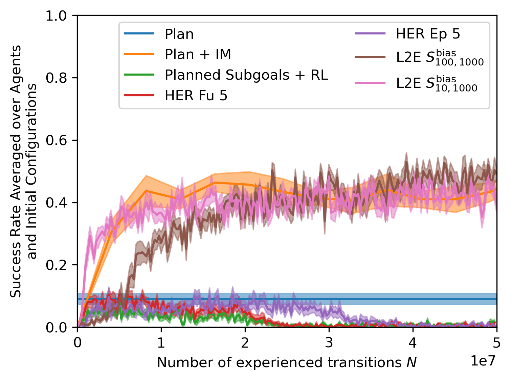
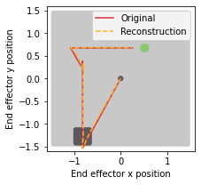
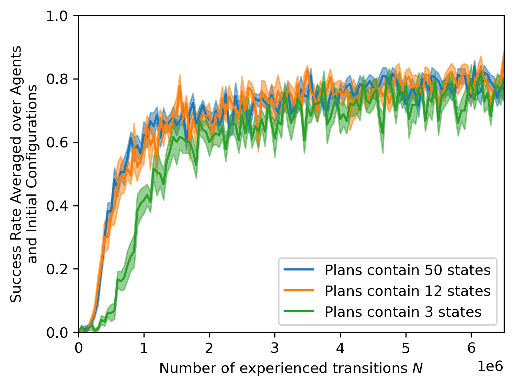

:warning: *Figure captions are hard to read if you use github in dark mode*
# Experiment 1: Obstacle Environment
We added this environment to expand the experimental evaluation of L2E.

## Description
The spherical end effector is rewarded for pushing the box to the green goal,
but is hindered by an obstacle in the middle of the table (see below).
Another difference to the original task is that the level of noise is increased.
At each step, the actual change in position of the end effector can be off up to 50% from the input velocity.

The planner outputs manhattan-like plans that avoid the obstacle. A single start-goal configuration can be solved using multiple plans, as shown below::

 | |
:-------------------------:|:-------------------------:|:-------------------------:
Obstacle Setup             |  Plan Execution Example 1           |  Plan Execution Example 2

We analytically encode these plans into a 6D latent space, corresponding to the initial, the final, and an intermediate planned position of the box. Please also see experiment 2 for a discussion of different types of encoding.

We compare against the baselines introduced in section 5.3 of the original version of the paper.

## Motivation
Obstacle avoidance is a notoriously hard problem in robotics.
The obstacle "segments" the state space, posing a significant challenge to exploration (as illustrated by the performance of the HER baseline).

Since obstacle avoidance requires more complicated plans, the L2E agent faces a larger plan space (6D plan manifold instead of 4D).
Thus, this example allows us to compare data requirements of L2E dependent on the size of the plan space.

On the other hand, due to the high level of noise, purely planning-based approaches often fail as well (as illustrated by the performance of the "Plan" baseline)
A combination of planning and learning (such as the "Plan + IM" baseline and L2E) can possibly overcome these difficulties.

## Experiment Status
The following figure shows a comparison of L2E to the baselines used in figure 1b of the original version.
The runs are not fully finished yet; results are updated regularly.

## Preliminary Results
L2E performs significantly better than the pure learning HER baselines, as well as the pure planning baseline ("Plan", in blue).
Currently, the runs are not fully finished, but initial results indicate that the performance of L2E is already comparable to the performance of the "Plan + IM" baseline.
The "Plan + IM" baseline executes the plan using an inverse model learned from data.

In comparison with the pushing experiment in the original version of the paper, L2E learns slower.
This is in part due to the higher dimensionality of the latent space of plan encodings (see also discussion of plan encodings below).
This poses a more challenging learning problem to the L2E agent.
In contrast, the "Plan + IM" baseline is independent of the size of the plan space, and performs comparably to the experimental setting in the original version. 

## Preliminary Discussion
This experiment reveals the following two aspects:
First, it reveals the importance of approximate plans in more complicated scenes, as illustrated by the difference between HER and L2E.
Even using HER, standard RL is not able to solve the task.
Second, comparing L2E to the pushing example in the original version of the paper, it highlights that for larger plan spaces, more data is needed to train the L2E agent.

# Experiment 2: Plan encoding
## Description
We compare three different ways to encode the plan for the pushing environment shown in the original version of the paper:

1. Analytical encoding into a 4D latent space (entries correspond to intermediate box positions)
2. Learned encoding using a variational autoencoder (VAE) trained with mean squared error (MSE) reconstruction loss, using a 4D latent space.
3. No encoding (plans are given in full to the policy).
   
For version 2., we use an encoder made up of 6 fully connected layers with sizes decreasing geometrically from 1024 to 32.
For the decoder, we use the same architecture in opposite direction.
Shown below are plans reconstructed by the trained VAE, together with the ground truth.
As in the other experiments, the plans are sequences of length 50, containing 6D vectors of the planned positions of end effector and box.
Shown below are only planned x- and y-positions of the end effector.
 | |
:-------------------------:|:-------------------------:|:-------------------------:
VAE Reconstruction Example 1 | VAE Reconstruction Example 2 | VAE Reconstruction Example 3

The table is indicated in light gray, the initial configuration is indicated in dark gray, and the box's goal position is shown in green.

## Motivation
Plan encoding is an important aspect of the L2E method.
This experiment investigates if (1) an encoding should be used at all and (2) whether it can be learned as well.

## Experiment Status
The following figure shows a comparison of option 1., 2., and 3.
The runs are not fully finished yet; results are updated regularly.

## Preliminary Results
We find that
1. Using any encoding significantly outperforms using no encoding at all.
2. Using an analytical encoding, in this case, outperforms using a learned encoding of the same dimensionality.

## Preliminary Discussion
These results show that using an encoding is beneficial, even if it has to be learned.
At least for the present example, using an analytical encoding was however more effective.

# Experiment 3: Plan density

## Description
We compare training the L2E agent using planned state sequences of different density.
This comparison is performed in the pushing environment presented in the original version of the paper.

## Motivation
Less dense plans result in a less informative reward shaping signal for the L2E agent.
This experiment investigates how much L2E relies on high-quality dense plans.

## Experiment Status
The following figure shows a comparison of different plan densities.
The runs are not fully finished yet; results are updated regularly.

## Preliminary Results
There is no significant difference between using 50 states and using 12 states.
When using 3 states, the less informative reward signal leads to a slightly flatter learning curve in the beginning, but the agent seems to recover from this later on.

## Preliminary Discussion
This analysis indicates that, while longer (more dense) plans increase sample efficiency particularly in the beginning, L2E is largely invariant to plan length.